<p align="center">
  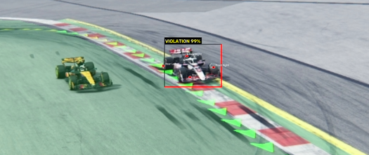
</p>

<h1 align="center">LineLimits</h1>

<p align="center">
  <b>Real-time, AI-powered track-limit violation detection for Formula 1</b><br>
  <i>Custom pose-estimation models · Per-camera boundary masks · Tiered ML pipeline · Race-control dashboard</i>
</p>

<p align="center">
  
  
  
  
  
  
</p>

---

## The Problem

Track-limit enforcement in motorsport currently relies on marshals manually reviewing live camera feeds — a process that is **slow, inconsistent, and error-prone**. With 8+ fixed cameras per circuit, each streaming continuously for the full duration of a session, the volume of footage is simply too large for human eyes alone.

<p align="center">
  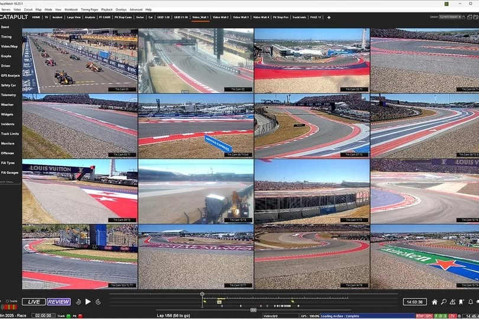<br>
  <i>The FIA's fixed-camera video wall — race control must monitor all feeds simultaneously</i>
</p>

<p align="center">
  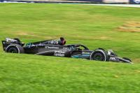<br>
  <i>The broadcast bottleneck: limited human bandwidth vs. continuous multi-camera streams</i>
</p>

LineLimits replaces this bottleneck with an **end-to-end ML pipeline** that processes all 8 camera feeds in real time, detects when a car leaves the track, identifies which car it is via transponder correlation, and alerts race control with a frame-accurate evidence clip — all within seconds.

---

## Approach: Pose Estimation on F1 Cars

The core insight is to treat the problem as **object pose estimation** rather than simple object detection. Just as human pose estimation locates joints on a person, LineLimits locates **wheel keypoints** on an F1 car — the four tyre contact patches that the FIA regulations actually care about.

<p align="center">
  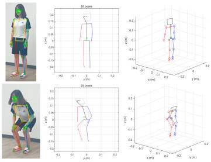
  &nbsp;&nbsp;&nbsp;&nbsp;
  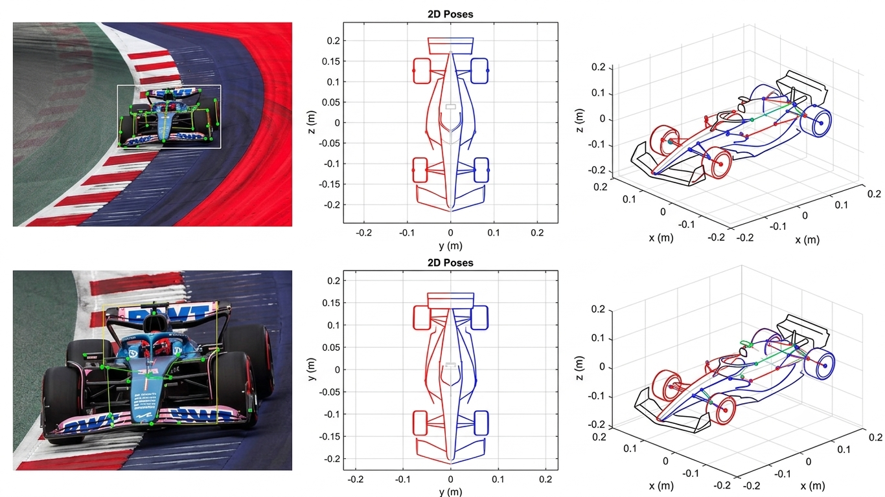<br>
  <i>Left: Human pose estimation as the foundational concept &nbsp;|&nbsp; Right: Adapted for F1 cars — 2D keypoints mapped to a 3D car model</i>
</p>

A custom **YOLOv8-Pose** model was trained on a 200-image dataset (annotated in Roboflow) to detect bounding boxes + 4 wheel keypoints per car. These keypoints are then checked against a **per-camera track boundary mask** to determine whether the car has exceeded track limits.

<p align="center">
  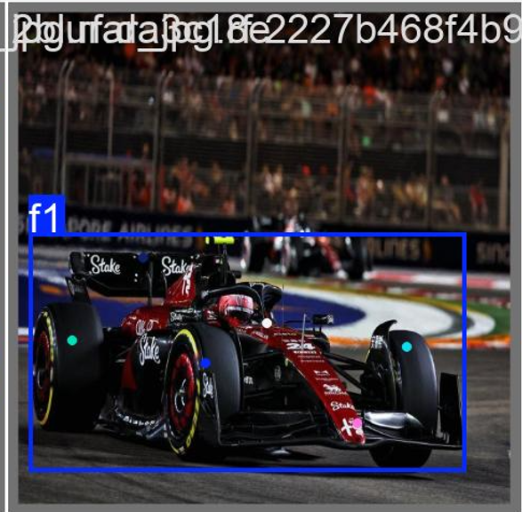
  &nbsp;
  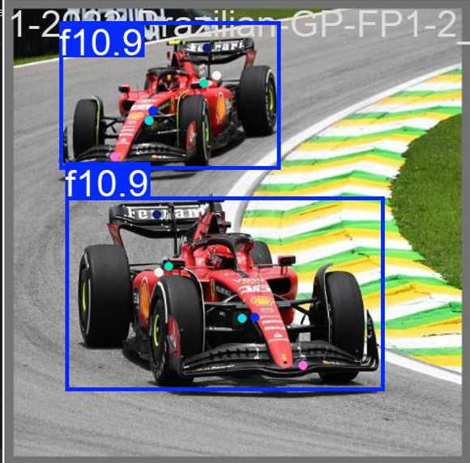
  &nbsp;
  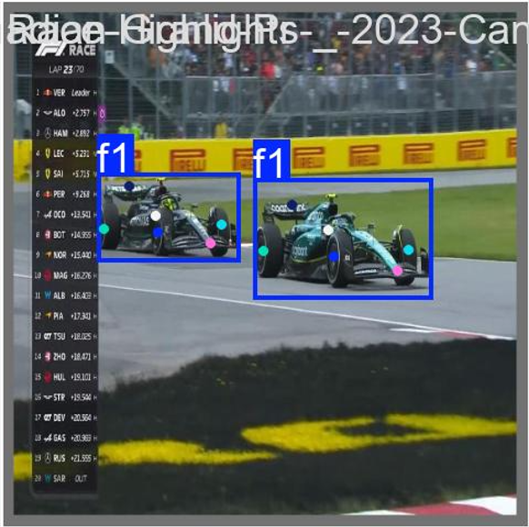<br>
  <i>Wheel keypoint detection on F1 cars across different angles, lighting, and multi-car scenarios</i>
</p>

---

## Training Data

The model was trained and iterated through 5 versions using **Roboflow** for annotation and dataset management:

<p align="center">
  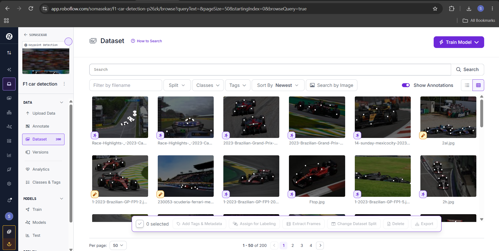<br>
  <i>200-image dataset annotated with bounding boxes and 6 keypoints (4 wheels + front/rear wings) across diverse race scenarios</i>
</p>

| Version | Dataset | Strategy | Notes |
|---------|---------|----------|-------|
| v1 | 70 images, color-only | Initial baseline | Good starting point |
| v2 | 70 + grayscale fine-tune | Domain adaptation | Handled simulation footage better |
| v3 | 105 combined (color + grayscale) | Train from scratch | Improved generalisation |
| **v4** | **200 images, color-only** | **Full dataset, clean labels** | **Current best — used in production** |
| v5 | 200 combined | Expanded combined | Experimental |

---

## Track Boundary Masks & Perspective Transform

Each camera has a **static track boundary mask** generated by `newewe.py` using COCO-format annotations of the track surface. The mask is a binary image where `1 = inside track` and `0 = outside track`. Wheel keypoints are checked against this mask to compute a violation probability.

For visualisation and debugging, a **bird's-eye perspective transform** maps the angled camera view to an overhead view, making it easier to verify boundary accuracy:

<p align="center">
  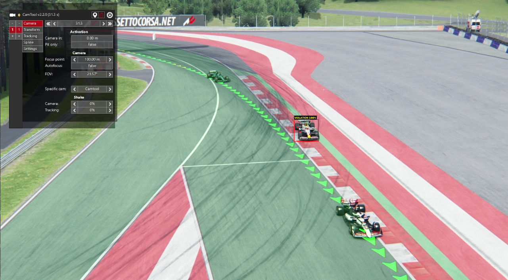
  &nbsp;&nbsp;
  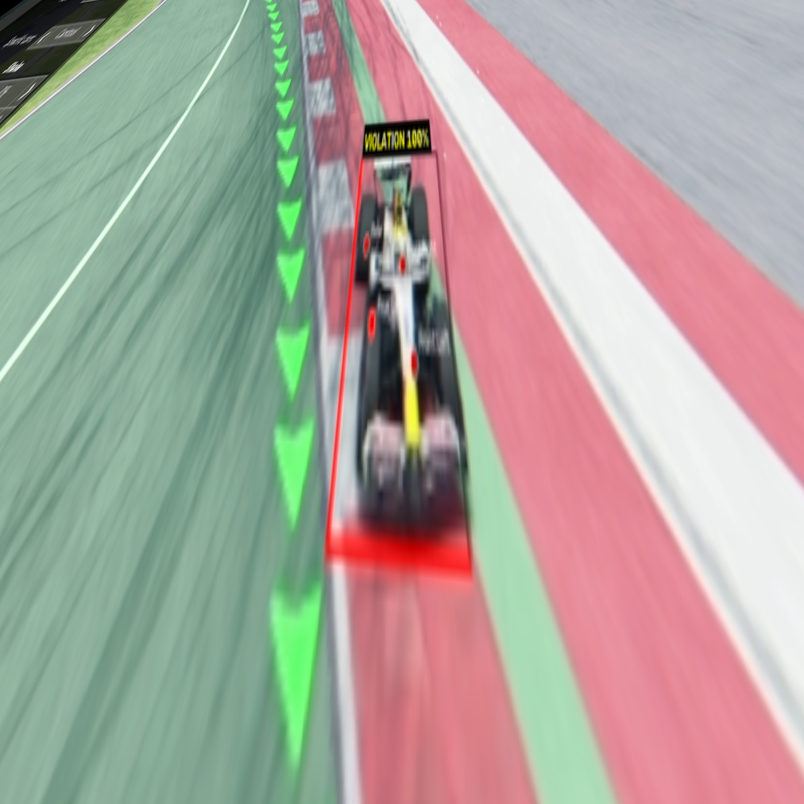<br>
  <i>Left: Original camera angle &nbsp;|&nbsp; Right: Bird's-eye perspective transform for boundary verification</i>
</p>

---

## System Architecture

```
┌─────────────────────────────────────────────────────────────────────────────┐
│                           8 × Fixed Camera Feeds                           │
│                     (CAM-1.mp4 .. CAM-8.mp4, 30fps)                        │
└────────────────────────────────┬────────────────────────────────────────────┘
                                 │
                                 ▼
┌─────────────────────────────────────────────────────────────────────────────┐
│  STEP 1 — Ingestion & Ring Buffer                                          │
│  ┌──────────────────────────────────────────────────────────────────────┐   │
│  │  shared_ring_buffer.py — Per-camera circular buffer (300 frames)    │   │
│  │  backed by multiprocessing.SharedMemory, 1280×720×3 per frame      │   │
│  └──────────────────────────────────────────────────────────────────────┘   │
└────────────────────────────────┬────────────────────────────────────────────┘
                                 │
                                 ▼
┌─────────────────────────────────────────────────────────────────────────────┐
│  STEP 2 — Tier 1: Lightweight Always-On Detector                           │
│  ┌──────────────────────────────────────────────────────────────────────┐   │
│  │  tier1_lightweight_detector.py — MOG2 background subtraction        │   │
│  │  Runs at 25% resolution, ~400px² min contour area                  │   │
│  │  Purpose: "Is there a car in frame?" (binary gate)                 │   │
│  └──────────────────────────────────────────────────────────────────────┘   │
│                                                                             │
│  On trigger → lock PRE_TRIGGER + POST_TRIGGER frames from ring buffer      │
└────────────────────────────────┬────────────────────────────────────────────┘
                                 │
                                 ▼
┌─────────────────────────────────────────────────────────────────────────────┐
│  STEP 3 — Tier 2: GPU Pose Estimation + Boundary Checking                  │
│  ┌──────────────────────────────────────────────────────────────────────┐   │
│  │  tier2_processor.py                                                 │   │
│  │  • Pose model (YOLOv8-Pose, best_v4_full_color.pt) on GPU          │   │
│  │  • Extracts 4 wheel keypoints + bounding box per frame             │   │
│  │  • track_boundary_checker.py: checks wheels against binary mask    │   │
│  │  • Violation probability = 0.6 × wheel_ratio + 0.4 × box_ratio   │   │
│  │  • Threshold: ≥ 80% → flag as violation                           │   │
│  │  • Boundary checking offloaded to Ray (CPU-only math)              │   │
│  └──────────────────────────────────────────────────────────────────────┘   │
└────────────────────────────────┬────────────────────────────────────────────┘
                                 │
                                 ▼
┌─────────────────────────────────────────────────────────────────────────────┐
│  STEP 4 — Alerting & Car Identification                                    │
│  ┌──────────────────────────────────────────────────────────────────────┐   │
│  │  alert_producer.py + car_identifier.py                              │   │
│  │  • Correlates violation window against transponder loop feed        │   │
│  │  • Identifies which car via RSSI + frame overlap scoring           │   │
│  │  • Lightweight JSON alert → Kafka topic or local JSONL log         │   │
│  │  • Annotated + raw MP4 clips saved to flagged/                     │   │
│  └──────────────────────────────────────────────────────────────────────┘   │
└────────────────────────────────┬────────────────────────────────────────────┘
                                 │
                                 ▼
┌─────────────────────────────────────────────────────────────────────────────┐
│  STEP 5 — Race Control Dashboard (Electron)                                │
│  ┌──────────────────────────────────────────────────────────────────────┐   │
│  │  application/ — Electron app with 8-up synced video grid            │   │
│  │  • Live telemetry log & alerts panel                                │   │
│  │  • Steward Review modal with frame-accurate scrubber               │   │
│  │  • Car identity overlay (driver, team, confidence)                 │   │
│  │  • Consumes Kafka topic or watches violations.jsonl                │   │
│  └──────────────────────────────────────────────────────────────────────┘   │
└─────────────────────────────────────────────────────────────────────────────┘
```

---

## Project Structure

```
lineLimits/
├── pipeline/                          # Real-time ML pipeline (Python)
│   ├── orchestrator.py                #   Entry point — master sync loop, Tier 1 → Tier 2 dispatch
│   ├── config.py                      #   Central configuration (paths, thresholds, model weights)
│   ├── shared_ring_buffer.py          #   Per-camera circular buffer (SharedMemory-backed)
│   ├── tier1_lightweight_detector.py  #   Always-on MOG2 motion detector (25% resolution)
│   ├── tier2_processor.py             #   GPU pose estimation + boundary checking (Ray)
│   ├── track_boundary_checker.py      #   Binary mask lookup + violation probability scoring
│   ├── car_identifier.py              #   Transponder-loop correlation for car identification
│   ├── alert_producer.py              #   Kafka / local JSONL alert sinks
│   ├── footage_mappings.py            #   Ground-truth violation windows for validation
│   ├── session_entry_list.json        #   Scrutineered entry list (drivers, teams, transponders)
│   └── transponder_feed.jsonl         #   Recorded transponder loop output for the session
│
├── models/
│   ├── pose-detection/                # YOLOv8-Pose custom F1 car keypoint model
│   │   ├── weights/                   #   Trained checkpoints (v1 → v5)
│   │   ├── training/                  #   Validation run outputs
│   │   ├── video_pose.py              #   Standalone video → annotated video script
│   │   └── readme.md                  #   Detailed training log
│   ├── track-segmentation/            # Track boundary mask generation
│   │   ├── newewe.py                  #   COCO annotations → binary masks + verification overlays
│   │   ├── train/                     #   COCO-format track annotations per camera
│   │   └── track_boundaries/          #   Output: masks/*.npz, verification/*.png
│   └── birdseye_transform.py          # Interactive 4-point perspective warp tool
│
├── application/                       # Electron race-control dashboard (JavaScript)
│   ├── main.js                        #   Electron main process (IPC, pipeline bridge, telemetry)
│   ├── preload.js                     #   Context bridge for renderer
│   ├── carIdentifier.js               #   JS port of transponder-loop correlation
│   ├── config.json                    #   Footage directory paths
│   ├── src/
│   │   ├── index.html                 #   Dashboard UI
│   │   ├── styles.css                 #   Full CSS (glassmorphism, dark mode, animations)
│   │   ├── renderer.js                #   8-up video grid, transport, telemetry, Steward Review
│   │   └── analysis.js                #   Violation statistics & analytics
│   └── package.json                   #   Electron 31+, npm start
│
├── simulation-footage/                # 8 × 2-min synced Assetto Corsa clips (CAM-1..8.mp4)
├── real-life-footage/                 # Real marshalling-post footage clips
├── flagged/                           # Pipeline output: annotated + raw violation clips
├── flag_test/                         # Manual test incidents for validation
│
├── reannotate_clips.py                # Re-render flagged clips with corrected pose overlays
├── reencode_flagged.py                # Re-encode flagged clips for Electron/browser playback
├── footage-mappings.txt               # Ground-truth violation windows per camera
├── requirements.txt                   # Python dependencies
└── README.md                          # ← You are here
```

---

## Getting Started

### Prerequisites

- **Python 3.11+** with CUDA-enabled PyTorch (RTX 4060 / similar recommended)
- **Node.js 18+** and npm
- **8 × camera feed videos** in `simulation-footage/` or `real-life-footage/`

### 1. Python Environment (Pipeline + Models)

```bash
# Create and activate virtual environment
python -m venv venv
venv\Scripts\activate        # Windows
# source venv/bin/activate   # Linux/macOS

# Install dependencies (CUDA build of PyTorch recommended)
pip install torch --index-url https://download.pytorch.org/whl/cu124
pip install -r requirements.txt
```

### 2. Generate Track Boundary Masks

Before running the pipeline, each camera needs a track boundary mask:

```bash
cd models/track-segmentation
python newewe.py
```

This reads COCO-format annotations from `train/` and produces binary `.npz` masks in `track_boundaries/masks/`.

### 3. Run the Pipeline

```bash
# Local mode (writes violations to pipeline/violations.jsonl)
python -m pipeline.orchestrator

# With Kafka alerting (requires a broker at localhost:9092)
python -m pipeline.orchestrator --use-kafka
```

The pipeline will:
1. Open all 8 camera feeds simultaneously
2. Run Tier 1 motion detection on every frame
3. On car detection → lock a clip → run Tier 2 GPU pose estimation
4. Flag violations ≥ 80% probability, identify the car via transponder correlation
5. Save annotated + raw clips to `flagged/`
6. Emit JSON alerts (local file or Kafka)

### 4. Launch the Dashboard

```bash
cd application
npm install
npm start
```

The Electron app will open with an 8-up synced video grid. It watches `pipeline/violations.jsonl` for new alerts and displays them in the telemetry panel. Click any alert to open the Steward Review modal with frame-accurate scrubbing.

---

## How It Works (Detail)

### Violation Probability Scoring

Each frame with a detected car is scored using a **weighted combination**:

```
probability = 0.6 × (wheels outside track / 4)
            + 0.4 × (bbox pixels outside track / total bbox pixels)
```

- **Wheel keypoints** (60% weight) — the primary signal; directly checks the 4 tyre contact patches
- **Bounding box overlap** (40% weight) — supporting evidence; catches cases where keypoint detection is uncertain

Frames scoring **≥ 80%** are flagged. The average probability across all flagged frames in a clip becomes the violation's confidence score.

### Car Identification

The pipeline knows *that* a car left the track on a given camera over a given frame window. It resolves *which* car using **transponder-loop correlation**: each marshalling post has a transponder loop co-located with its camera. The violation's frame window is correlated against all loop reads for that camera, scoring candidates on:

- **Coverage** (75% weight) — how much of the violation window the transponder read spans
- **Signal strength** (25% weight) — normalised peak RSSI of the read

### Ground-Truth Validation

`footage-mappings.txt` contains manually annotated violation windows. The pipeline cross-references detections against these windows and only saves clips that match a known violation, suppressing false positives during development.

---

## Configuration

All pipeline settings live in [`pipeline/config.py`](pipeline/config.py):

| Parameter | Default | Description |
|-----------|---------|-------------|
| `FOOTAGE_DIR` | `simulation-footage/` | Source video directory |
| `POSE_WEIGHTS` | `best_v4_full_color.pt` | Active pose model checkpoint |
| `RING_BUFFER_FRAMES` | 300 | Ring buffer depth per camera |
| `PRE_TRIGGER_FRAMES` | 100 | Frames kept before car detection |
| `POST_TRIGGER_FRAMES` | 200 | Frames kept after car detection |
| `VIOLATION_PROBABILITY_THRESHOLD` | 0.80 | Minimum score to flag a violation |
| `WHEEL_WEIGHT` / `BOX_WEIGHT` | 0.6 / 0.4 | Scoring component weights |
| `TIER1_DOWNSCALE` | 0.25 | Tier 1 processing resolution |
| `RAY_NUM_CPUS` | 4 | Ray cluster CPU allocation |
| `KAFKA_BOOTSTRAP_SERVERS` | `localhost:9092` | Kafka broker address |

---

## Tech Stack

| Layer | Technology | Purpose |
|-------|-----------|---------|
| Pose Estimation | YOLOv8-Pose (Ultralytics) | Wheel keypoint + bbox detection |
| Track Boundaries | OpenCV + COCO annotations | Per-camera binary inside-track masks |
| Motion Detection | OpenCV MOG2 | Tier 1 always-on car presence gate |
| GPU Inference | PyTorch + CUDA | Tier 2 pose model on RTX 4060 |
| Distributed Compute | Ray | CPU-bound boundary checking tasks |
| Alerting | Kafka / Local JSONL | Violation event delivery |
| Car Identification | Transponder-loop correlation | RSSI + frame-overlap scoring |
| Dashboard | Electron 31 | 8-up video grid, Steward Review UI |
| Dataset Management | Roboflow | Annotation, versioning, export |
| Simulation | Assetto Corsa + CamTool | 8-camera synced footage generation |

---

## License

This project is unlicensed / private. All rights reserved.
